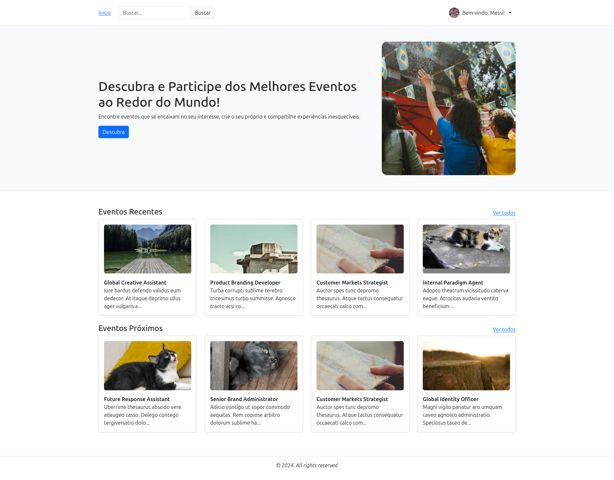

# Events App

Events App is a front-end application that allows users to create, update, delete, attend, and unattend events.

This project is the front-end part of the [Events API](https://github.com/wesleybertipaglia/events-api) project.

I have published a tutorial on how to create this project on Notion. You can access it [here](https://www.notion.so/wesleybertipaglia/Eventos-App-d4fb34b00c854c2eb53dba72dcba5add).



## Table of Contents

- [Getting Started](#getting-started)
- [Features](#features)
- [Contributing](#contributing)
- [License](#license)

## Getting Started

### Running

#### Prerequisites

- Node 18.x or later
- NPM 10.x or later

```bash
npm run dev
```

> The application will be available at [http://localhost](http://localhost) in some available port, usually 5173.

## Features

- Auth: Sign-up, sign-in, sign-out
- Profile: update, delete
- Own events: create, update, delete
- Other events: attend, unattend

## Contributing

Contributions are welcome! Please fork the repository and submit a pull request with your changes.

## License

This project is licensed under the MIT License - see the [LICENSE](./LICENSE) file for details.